# Programmentwurf

**Card Repetition (card-rep)**

Name: [Name, Vorname]
Matrikelnummer: [MNR]

Abgabedatum: [DATUM]

---

## Inhaltsverzeichnis

1. [Kapitel 1: Einführung](#kapitel-1-einführung)
2. [Kapitel 2: Clean Architecture](#kapitel-2-clean-architecture)
3. [Kapitel 3: SOLID](#kapitel-3-solid)
4. [Kapitel 4: Weitere Prinzipien](#kapitel-4-weitere-prinzipien)
5. [Kapitel 5: Unit Tests](#kapitel-5-unit-tests)
6. [Kapitel 6: Domain Driven Design](#kapitel-6-domain-driven-design)
7. [Kapitel 7: Refactoring](#kapitel-7-refactoring)
8. [Kapitel 8: Entwurfsmuster](#kapitel-8-entwurfsmuster)

---

## Kapitel 1: Einführung

### Übersicht über die Applikation

Card Repetition ist eine terminalbasierte Lernapplikation für Spaced Repetition (ähnlich Anki), implementiert in **Java 25** mit **Maven**. Benutzer organisieren Lernmaterial in **Collections** (hierarchische Ordner), die **Decks** enthalten, welche wiederum **Cards** (Vorder-/Rückseite-Karteikarten) beinhalten. Während einer **Learning Session** werden Karten basierend auf einem konfigurierbaren **Repetition Algorithm** (Strategy Pattern) präsentiert. Der Benutzer bewertet die wahrgenommene **Difficulty**, und das System verfolgt **CardStats** und **DeckStats**, wobei Observer (Observer Pattern) über Statistikänderungen benachrichtigt werden.

Die Applikation löst das Problem des effizienten Lernens durch Wiederholung: Schwierige Karten werden häufiger präsentiert als leichte, was den Lerneffekt maximiert.

### Wie startet man die Applikation?

**Voraussetzungen:**
- Java 25 (JDK)
- Maven 3.x

**Schritte:**

```bash
# Repository klonen
git clone git@github.com:GilbertBckr/card-rep.git
cd card-rep

# Projekt kompilieren
mvn clean compile

# Applikation starten
mvn exec:java -Dexec.mainClass="com.cardrep.adapter.cli.CardRepApp"
```

### Wie testet man die Applikation?

```bash
# Alle Unit Tests ausführen
mvn test

# Test Coverage Report generieren
mvn test jacoco:report
# Report öffnen: target/site/jacoco/index.html
```

### Technology Stack

| Komponente       | Technologie             |
|------------------|-------------------------|
| Sprache          | Java 25                 |
| Build Tool       | Maven                   |
| Testing          | JUnit 5.10.2            |
| Mocking          | Mockito 5.18.0          |
| Code Coverage    | JaCoCo 0.8.14           |
| Persistenz       | In-Memory (HashMap)     |

### Kommentar-Richtlinie

Dieses Projekt folgt dem Clean-Code-Prinzip für Kommentare: Code soll selbsterklärend sein. Kommentare werden ausschließlich für **nicht-offensichtliche Design-Entscheidungen** verwendet (z.B. Geschäftsregeln, Invarianten, bewusste Einschränkungen, Kaskadenverhalten). Entwurfsmuster-Annotationen werden nicht kommentiert, da sie aus der Code-Struktur ersichtlich sind. Erklärende Kommentare, die lediglich beschreiben was der Code tut, werden vermieden: stattdessen drücken aussagekräftige Methoden- und Variablennamen die Intention aus.

---

## Kapitel 2: Clean Architecture

### Was ist Clean Architecture?

Clean Architecture ist ein Architekturmuster, das Software in konzentrische Schichten unterteilt. Die zentrale Regel ist die **Dependency Rule**: Abhängigkeiten dürfen nur von außen nach innen zeigen. Die inneren Schichten (Domain, Application) kennen die äußeren Schichten (Plugin, Adapter) nicht. Dies ermöglicht austauschbare Infrastruktur (z.B. Datenbank wechseln), unabhängige Testbarkeit der Geschäftslogik, und klare Trennung der Verantwortlichkeiten. Die Domain-Schicht enthält Entitäten und Geschäftsregeln, die Application-Schicht orchestriert Use Cases, die Plugin-Schicht liefert Implementierungen, und die Adapter-Schicht verbindet mit der Außenwelt.

### Schichtendiagramm

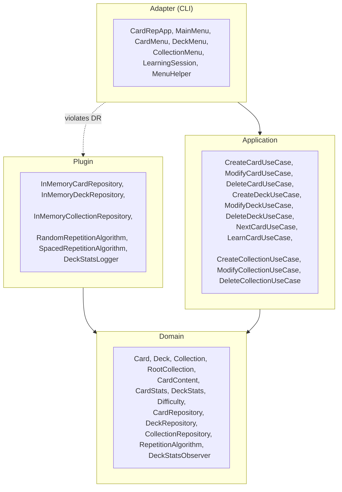
```mermaid
flowchart TD
    subgraph Adapter["Adapter (CLI)"]
        A["CardRepApp, MainMenu, CardMenu, DeckMenu,
        CollectionMenu, LearningSession, MenuHelper"]
    end
    subgraph PluginLayer["Plugin"]
        B["InMemoryCardRepository, InMemoryDeckRepository,
        InMemoryCollectionRepository,
        RandomRepetitionAlgorithm, SpacedRepetitionAlgorithm,
        DeckStatsLogger"]
    end
    subgraph Application["Application"]
        C["CreateCardUseCase, ModifyCardUseCase, DeleteCardUseCase,
        CreateDeckUseCase, ModifyDeckUseCase, DeleteDeckUseCase,
        NextCardUseCase, LearnCardUseCase,
        CreateCollectionUseCase, ModifyCollectionUseCase, DeleteCollectionUseCase"]
    end
    subgraph Domain["Domain"]
        D["Card, Deck, Collection, RootCollection,
        CardContent, CardStats, DeckStats, Difficulty,
        CardRepository, DeckRepository,
        CollectionRepository, RepetitionAlgorithm,
        DeckStatsObserver"]
    end
    Adapter -.->|violates DR| PluginLayer
    Adapter --> Application
    PluginLayer --> Domain
    Application --> Domain
```

### Analyse der Dependency Rule

#### Positiv-Beispiel: CreateCardUseCase

`CreateCardUseCase` (`src/main/java/com/cardrep/application/card/CreateCardUseCase.java`) hängt ausschließlich von Domain-Interfaces ab (`CardRepository`, `DeckRepository`). Es hat keine Kenntnis von `InMemoryCardRepository` oder einer anderen Plugin-Klasse.

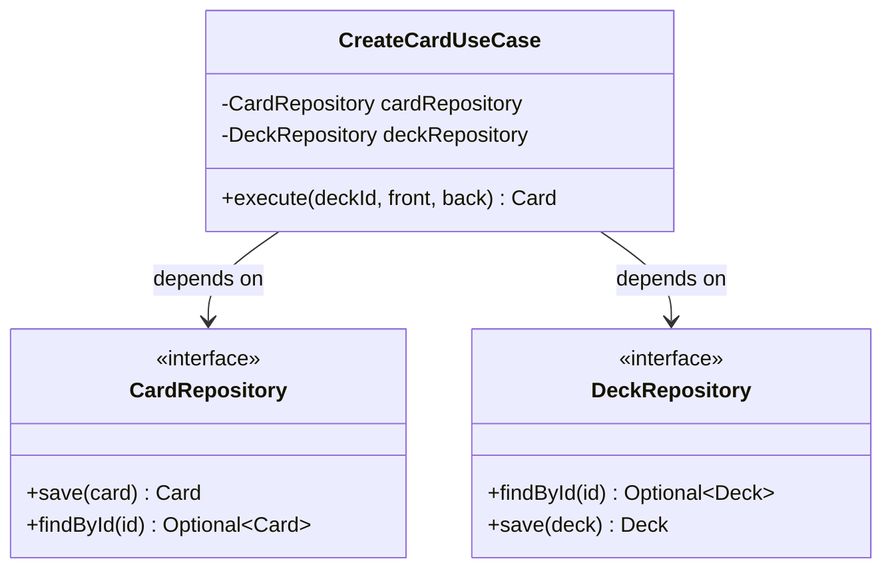
```mermaid
classDiagram
    class CreateCardUseCase {
        -CardRepository cardRepository
        -DeckRepository deckRepository
        +execute(deckId, front, back) Card
    }
    class CardRepository {
        <<interface>>
        +save(card) Card
        +findById(id) Optional~Card~
    }
    class DeckRepository {
        <<interface>>
        +findById(id) Optional~Deck~
        +save(deck) Deck
    }
    CreateCardUseCase --> CardRepository : depends on
    CreateCardUseCase --> DeckRepository : depends on
```

**Analyse:** `CreateCardUseCase` (Application-Schicht) hängt ab von `CardRepository` und `DeckRepository` (Domain-Schicht): Abhängigkeit zeigt nach innen. Niemand aus der Domain hängt von `CreateCardUseCase` ab. Die konkrete Implementierung `InMemoryCardRepository` (Plugin) kennt `CreateCardUseCase` nicht: die Dependency Rule ist eingehalten.

#### Negativ-Beispiel: DeckMenu

`DeckMenu` (`src/main/java/com/cardrep/adapter/cli/DeckMenu.java:12-13`) importiert konkrete Plugin-Klassen (`RandomRepetitionAlgorithm`, `SpacedRepetitionAlgorithm`) statt sich nur auf das Domain-Interface `RepetitionAlgorithm` zu verlassen.

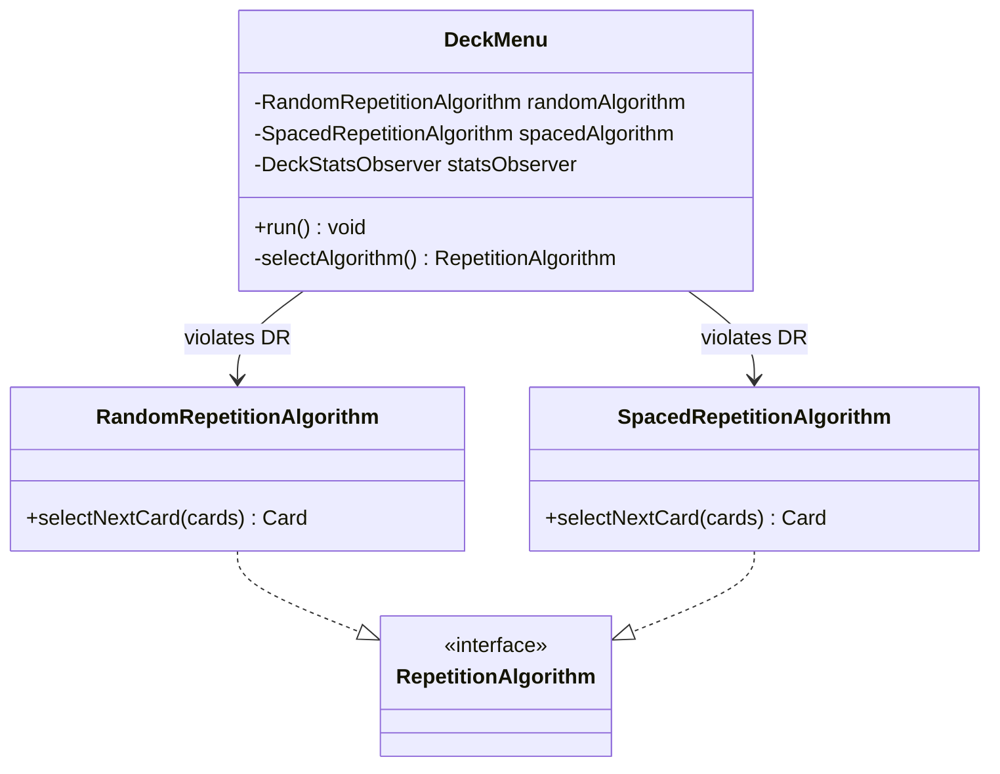
```mermaid
classDiagram
    class DeckMenu {
        -RandomRepetitionAlgorithm randomAlgorithm
        -SpacedRepetitionAlgorithm spacedAlgorithm
        -DeckStatsObserver statsObserver
        +run() void
        -selectAlgorithm() RepetitionAlgorithm
    }
    class RandomRepetitionAlgorithm {
        +selectNextCard(cards) Card
    }
    class SpacedRepetitionAlgorithm {
        +selectNextCard(cards) Card
    }
    class RepetitionAlgorithm {
        <<interface>>
    }
    DeckMenu --> RandomRepetitionAlgorithm : violates DR
    DeckMenu --> SpacedRepetitionAlgorithm : violates DR
    RandomRepetitionAlgorithm ..|> RepetitionAlgorithm
    SpacedRepetitionAlgorithm ..|> RepetitionAlgorithm
```

**Analyse:** `DeckMenu` (Adapter-Schicht) hängt direkt von `RandomRepetitionAlgorithm` und `SpacedRepetitionAlgorithm` (Plugin-Schicht) ab. Die Adapter-Schicht referenziert die Plugin-Schicht: das verletzt die Dependency Rule, da beide äußere Schichten sind und keine davon von der anderen abhängen sollte. Lösung: `DeckMenu` sollte eine `List<RepetitionAlgorithm>` injiziert bekommen und das Menü dynamisch aus `getName()` aufbauen.

```java
// DeckMenu.java:12-13: Verletzung: Import konkreter Plugin-Typen
import com.cardrep.plugin.algorithm.RandomRepetitionAlgorithm;
import com.cardrep.plugin.algorithm.SpacedRepetitionAlgorithm;
```

### Analyse der Schichten

#### Schicht: Domain: `Deck`

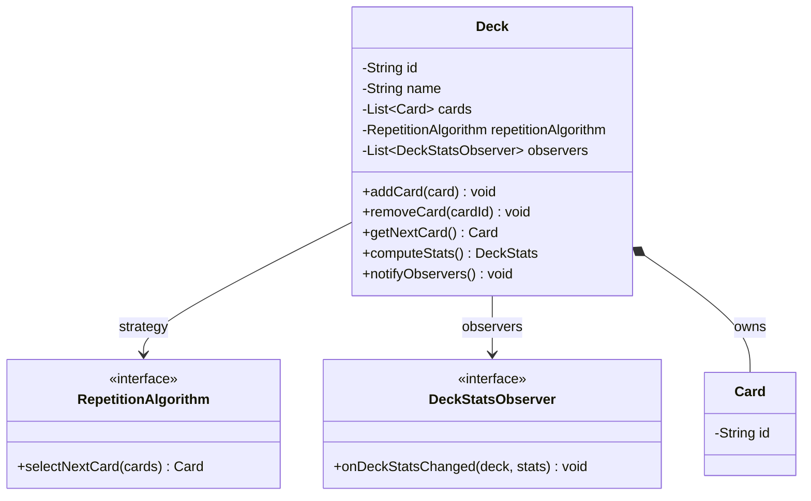
```mermaid
classDiagram
    class Deck {
        -String id
        -String name
        -List~Card~ cards
        -RepetitionAlgorithm repetitionAlgorithm
        -List~DeckStatsObserver~ observers
        +addCard(card) void
        +removeCard(cardId) void
        +getNextCard() Card
        +computeStats() DeckStats
        +notifyObservers() void
    }
    class RepetitionAlgorithm {
        <<interface>>
        +selectNextCard(cards) Card
    }
    class DeckStatsObserver {
        <<interface>>
        +onDeckStatsChanged(deck, stats) void
    }
    class Card {
        -String id
    }
    Deck --> RepetitionAlgorithm : strategy
    Deck --> DeckStatsObserver : observers
    Deck *-- Card : owns
```

**Aufgabe:** `Deck` ist das zentrale Aggregate Root der Domain-Schicht. Es verwaltet eine Sammlung von Cards, delegiert die Kartenauswahl an eine konfigurierbare Strategie und benachrichtigt Observer bei Änderungen.

**Einordnung:** Domain-Schicht, weil `Deck` ausschließlich Geschäftslogik enthält (Kartenauswahl, Statistikberechnung, Observer-Benachrichtigung) und keine Abhängigkeiten zu äußeren Schichten hat. Alle Abhängigkeiten (`RepetitionAlgorithm`, `DeckStatsObserver`) sind als Interfaces in der Domain definiert.

#### Schicht: Application: `LearnCardUseCase`

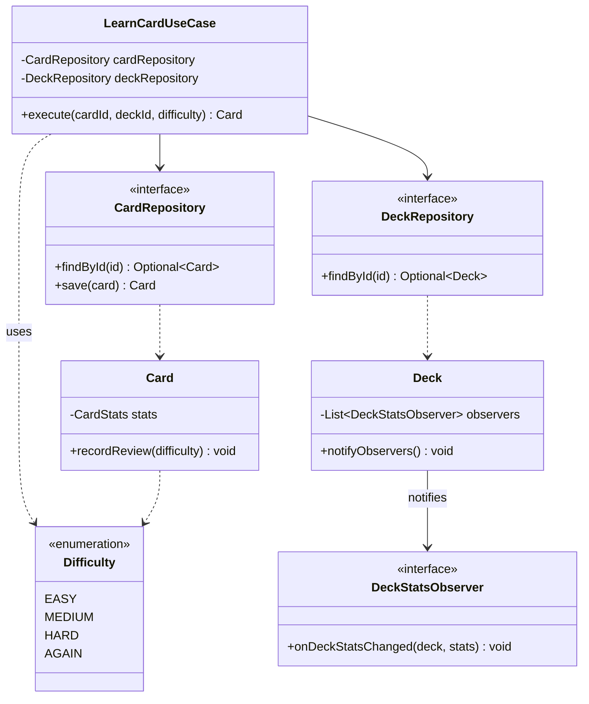
```mermaid
classDiagram
    %% ──── Application Layer ────
    class LearnCardUseCase {
        -CardRepository cardRepository
        -DeckRepository deckRepository
        +execute(cardId, deckId, difficulty) Card
    }

    %% ──── Domain Layer ────
    class CardRepository {
        <<interface>>
        +findById(id) Optional~Card~
        +save(card) Card
    }
    class DeckRepository {
        <<interface>>
        +findById(id) Optional~Deck~
    }
    class Card {
        -CardStats stats
        +recordReview(difficulty) void
    }
    class Deck {
        -List~DeckStatsObserver~ observers
        +notifyObservers() void
    }
    class Difficulty {
        <<enumeration>>
        EASY
        MEDIUM
        HARD
        AGAIN
    }
    class DeckStatsObserver {
        <<interface>>
        +onDeckStatsChanged(deck, stats) void
    }

    LearnCardUseCase --> CardRepository
    LearnCardUseCase --> DeckRepository
    LearnCardUseCase ..> Difficulty : uses
    CardRepository ..> Card
    DeckRepository ..> Deck
    Card ..> Difficulty
    Deck --> DeckStatsObserver : notifies
```

**Aufgabe:** `LearnCardUseCase` orchestriert den Lernvorgang: Es lädt die Karte, zeichnet die Review auf (mit Schwierigkeitsgrad), speichert die aktualisierte Karte und benachrichtigt Observer über Deck-Statistikänderungen.

**Einordnung:** Application-Schicht, weil es einen konkreten Anwendungsfall orchestriert und dabei ausschließlich Domain-Interfaces verwendet. Es enthält keine Geschäftslogik selbst (die liegt in `Card.recordReview()` und `Deck.notifyObservers()`), sondern koordiniert den Ablauf zwischen Domain-Objekten.

---

## Kapitel 3: SOLID

### Analyse Single-Responsibility-Principle (SRP)

#### Positiv-Beispiel: CreateCardUseCase

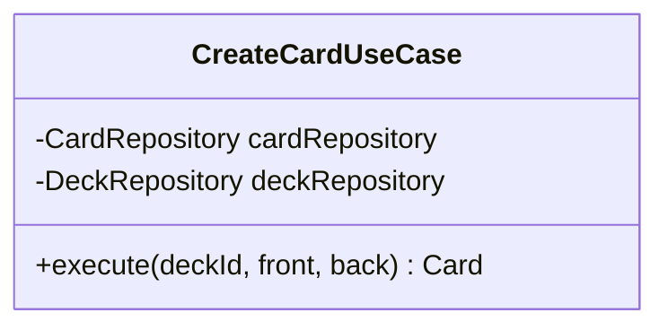
```mermaid
classDiagram
    class CreateCardUseCase {
        -CardRepository cardRepository
        -DeckRepository deckRepository
        +execute(deckId, front, back) Card
    }
```

**Aufgabe:** `CreateCardUseCase` (`src/main/java/com/cardrep/application/card/CreateCardUseCase.java`) hat genau eine Verantwortlichkeit: das Erstellen einer neuen Karte und deren Hinzufügen zu einem Deck. Es validiert die Deck-Existenz, erstellt die Karte, speichert sie und fügt sie dem Deck hinzu. Wenn sich die Karten-Erstellungslogik ändert, muss nur diese Klasse angepasst werden.

#### Negativ-Beispiel: DeckMenu

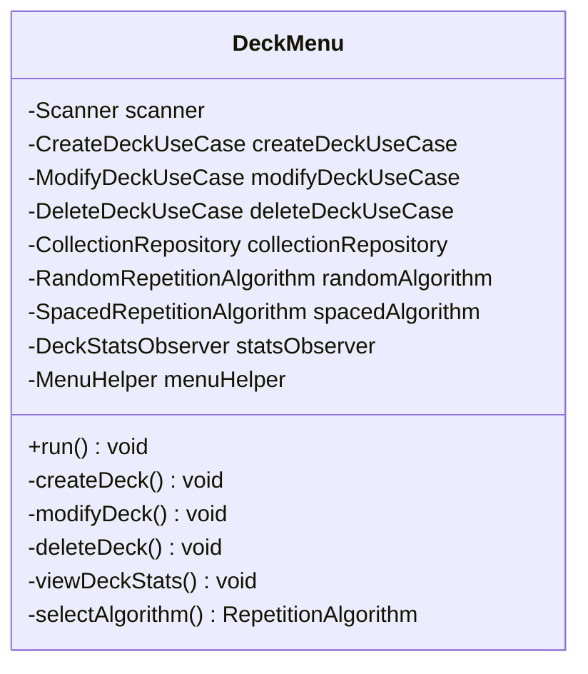
```mermaid
classDiagram
    class DeckMenu {
        -Scanner scanner
        -CreateDeckUseCase createDeckUseCase
        -ModifyDeckUseCase modifyDeckUseCase
        -DeleteDeckUseCase deleteDeckUseCase
        -CollectionRepository collectionRepository
        -RandomRepetitionAlgorithm randomAlgorithm
        -SpacedRepetitionAlgorithm spacedAlgorithm
        -DeckStatsObserver statsObserver
        -MenuHelper menuHelper
        +run() void
        -createDeck() void
        -modifyDeck() void
        -deleteDeck() void
        -viewDeckStats() void
        -selectAlgorithm() RepetitionAlgorithm
    }
```

**Aufgaben:** `DeckMenu` (`src/main/java/com/cardrep/adapter/cli/DeckMenu.java`) hat mehrere Verantwortlichkeiten:
1. CRUD-Operationen für Decks
2. Algorithmus-Auswahl
3. Statistik-Anzeige
4. User-Input-Parsing

Es hat vier Gründe sich zu ändern: (1) Deck-Operationen ändern sich, (2) Algorithmus-Auswahl ändert sich, (3) Statistik-Anzeige ändert sich, (4) Input-Handling ändert sich.

**Möglicher Lösungsweg:**

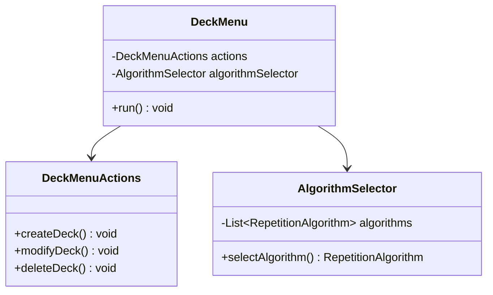
```mermaid
classDiagram
    class DeckMenu {
        -DeckMenuActions actions
        -AlgorithmSelector algorithmSelector
        +run() void
    }
    class DeckMenuActions {
        +createDeck() void
        +modifyDeck() void
        +deleteDeck() void
    }
    class AlgorithmSelector {
        -List~RepetitionAlgorithm~ algorithms
        +selectAlgorithm() RepetitionAlgorithm
    }
    DeckMenu --> DeckMenuActions
    DeckMenu --> AlgorithmSelector
```

### Analyse Open-Closed-Principle (OCP)

#### Positiv-Beispiel: RepetitionAlgorithm

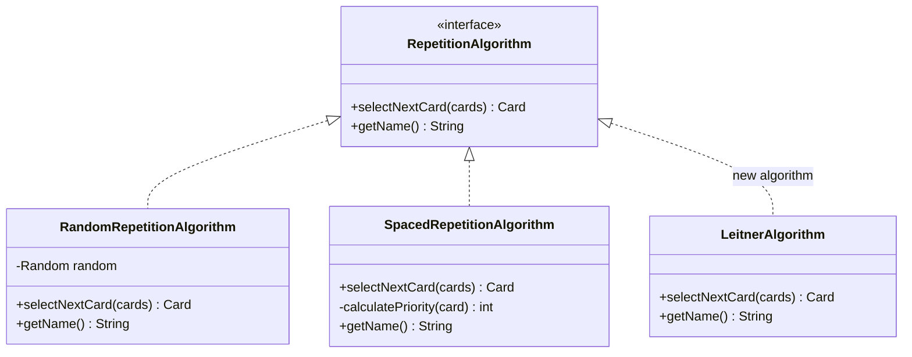
```mermaid
classDiagram
    class RepetitionAlgorithm {
        <<interface>>
        +selectNextCard(cards) Card
        +getName() String
    }
    class RandomRepetitionAlgorithm {
        -Random random
        +selectNextCard(cards) Card
        +getName() String
    }
    class SpacedRepetitionAlgorithm {
        +selectNextCard(cards) Card
        -calculatePriority(card) int
        +getName() String
    }
    class LeitnerAlgorithm {
        +selectNextCard(cards) Card
        +getName() String
    }
    RepetitionAlgorithm <|.. RandomRepetitionAlgorithm
    RepetitionAlgorithm <|.. SpacedRepetitionAlgorithm
    RepetitionAlgorithm <|.. LeitnerAlgorithm : new algorithm
```

**Analyse:** Das `RepetitionAlgorithm`-Interface (`src/main/java/com/cardrep/domain/service/RepetitionAlgorithm.java`) ist offen für Erweiterung: Neue Algorithmen (z.B. `LeitnerAlgorithm`) können durch Implementierung des Interfaces hinzugefügt werden, ohne bestehenden Code zu modifizieren. Die existierenden Klassen `RandomRepetitionAlgorithm` und `SpacedRepetitionAlgorithm` bleiben unverändert. Das ist hier sinnvoll, weil verschiedene Lernstrategien ein natürlicher Erweiterungspunkt sind.

#### Negativ-Beispiel: DeckMenu.selectAlgorithm()

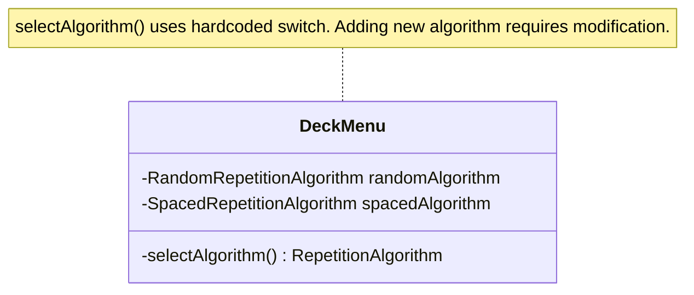
```mermaid
classDiagram
    class DeckMenu {
        -RandomRepetitionAlgorithm randomAlgorithm
        -SpacedRepetitionAlgorithm spacedAlgorithm
        -selectAlgorithm() RepetitionAlgorithm
    }
    note for DeckMenu "selectAlgorithm() uses hardcoded switch. Adding new algorithm requires modification."
```

**Analyse:** Die Methode `selectAlgorithm()` in `DeckMenu` (`src/main/java/com/cardrep/adapter/cli/DeckMenu.java:183-198`) verwendet ein hardcodiertes Switch-Statement:

```java
return switch (choice) {
    case "1" -> spacedAlgorithm;
    case "2" -> randomAlgorithm;
    default -> spacedAlgorithm;
};
```

Das Hinzufügen eines neuen Algorithmus erfordert eine Modifikation dieser Methode: OCP verletzt.

**Möglicher Lösungsweg:**

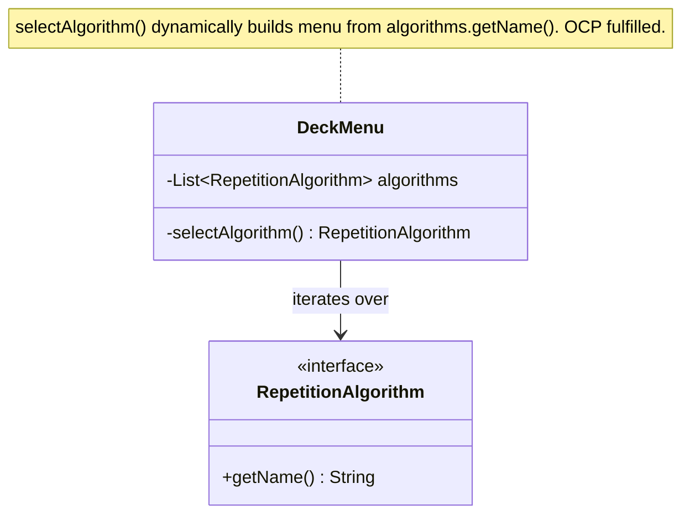
```mermaid
classDiagram
    class DeckMenu {
        -List~RepetitionAlgorithm~ algorithms
        -selectAlgorithm() RepetitionAlgorithm
    }
    class RepetitionAlgorithm {
        <<interface>>
        +getName() String
    }
    DeckMenu --> RepetitionAlgorithm : iterates over
    note for DeckMenu "selectAlgorithm() dynamically builds menu from algorithms.getName(). OCP fulfilled."
```

Lösung: Eine `List<RepetitionAlgorithm>` injizieren und das Menü dynamisch aufbauen. Neue Algorithmen werden einfach zur Liste hinzugefügt.

### Analyse Dependency-Inversion-Principle (DIP)

#### Positiv-Beispiel: DeleteDeckUseCase

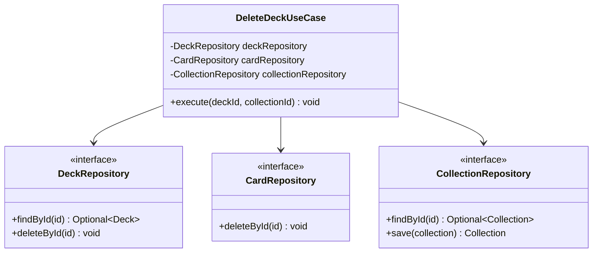
```mermaid
classDiagram
    class DeleteDeckUseCase {
        -DeckRepository deckRepository
        -CardRepository cardRepository
        -CollectionRepository collectionRepository
        +execute(deckId, collectionId) void
    }
    class DeckRepository {
        <<interface>>
        +findById(id) Optional~Deck~
        +deleteById(id) void
    }
    class CardRepository {
        <<interface>>
        +deleteById(id) void
    }
    class CollectionRepository {
        <<interface>>
        +findById(id) Optional~Collection~
        +save(collection) Collection
    }
    DeleteDeckUseCase --> DeckRepository
    DeleteDeckUseCase --> CardRepository
    DeleteDeckUseCase --> CollectionRepository
```

**Begründung:** `DeleteDeckUseCase` (`src/main/java/com/cardrep/application/deck/DeleteDeckUseCase.java`) hängt ausschließlich von Abstraktionen ab (Interfaces definiert in der Domain-Schicht). Die konkreten Implementierungen (`InMemoryDeckRepository` etc.) werden am Composition Root (`CardRepApp.java`) injiziert. Das High-Level-Modul (Use Case) ist vom Low-Level-Modul (In-Memory Storage) entkoppelt.

#### Negativ-Beispiel: DeckMenu

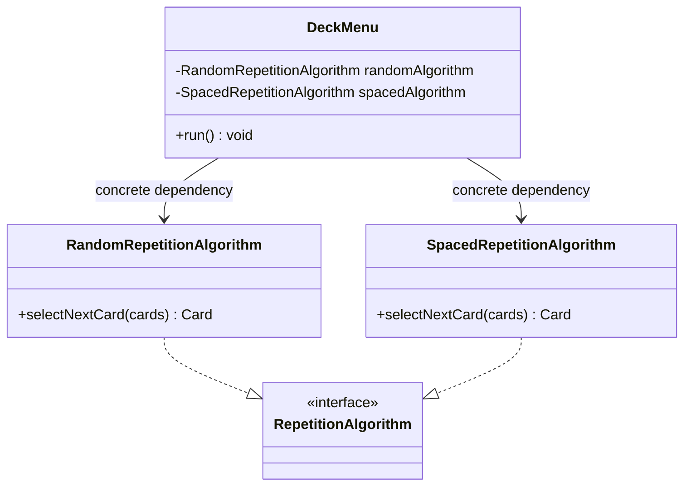
```mermaid
classDiagram
    class DeckMenu {
        -RandomRepetitionAlgorithm randomAlgorithm
        -SpacedRepetitionAlgorithm spacedAlgorithm
        +run() void
    }
    class RandomRepetitionAlgorithm {
        +selectNextCard(cards) Card
    }
    class SpacedRepetitionAlgorithm {
        +selectNextCard(cards) Card
    }
    class RepetitionAlgorithm {
        <<interface>>
    }
    DeckMenu --> RandomRepetitionAlgorithm : concrete dependency
    DeckMenu --> SpacedRepetitionAlgorithm : concrete dependency
    RandomRepetitionAlgorithm ..|> RepetitionAlgorithm
    SpacedRepetitionAlgorithm ..|> RepetitionAlgorithm
```

**Begründung:** `DeckMenu` (`src/main/java/com/cardrep/adapter/cli/DeckMenu.java:25-46`) hängt direkt von konkreten Klassen ab statt von Abstraktionen:

```java
// Verletzung: Konstruktor-Parameter sind konkrete Typen, keine Abstraktionen
private final RandomRepetitionAlgorithm randomAlgorithm;
private final SpacedRepetitionAlgorithm spacedAlgorithm;
```

Eine DIP-konforme Lösung wäre: `private final List<RepetitionAlgorithm> algorithms;`: dann hängt `DeckMenu` nur von der Abstraktion `RepetitionAlgorithm` ab.

---

## Kapitel 4: Weitere Prinzipien

### Analyse GRASP: Geringe Kopplung

#### Positiv-Beispiel: CardStats

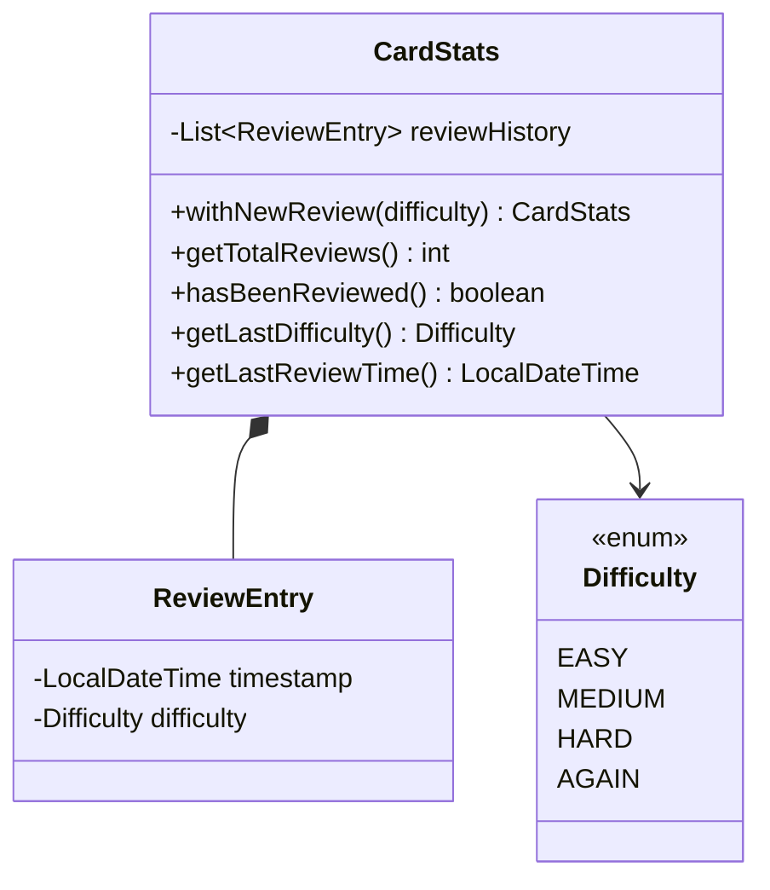
```mermaid
classDiagram
    class CardStats {
        -List~ReviewEntry~ reviewHistory
        +withNewReview(difficulty) CardStats
        +getTotalReviews() int
        +hasBeenReviewed() boolean
        +getLastDifficulty() Difficulty
        +getLastReviewTime() LocalDateTime
    }
    class ReviewEntry {
        -LocalDateTime timestamp
        -Difficulty difficulty
    }
    class Difficulty {
        <<enum>>
        EASY
        MEDIUM
        HARD
        AGAIN
    }
    CardStats *-- ReviewEntry
    CardStats --> Difficulty
```

**Aufgabe:** `CardStats` (`src/main/java/com/cardrep/domain/model/CardStats.java`) verwaltet die Review-Historie einer Karte (Zeitpunkte, Schwierigkeitsgrade, Statistiken).

**Begründung geringe Kopplung:** `CardStats` hat nur Abhängigkeiten zu seinen eigenen inneren Typen (`ReviewEntry`) und dem einfachen Enum `Difficulty`. Es hat keine Abhängigkeiten zu Repositories, Services, oder anderen Schichten. Die `withNewReview()`-Methode gibt eine neue Instanz zurück (Immutability), was die Kopplung weiter reduziert: keine Seiteneffekte durch geteilten Zustand.

#### Negativ-Beispiel: DeckMenu

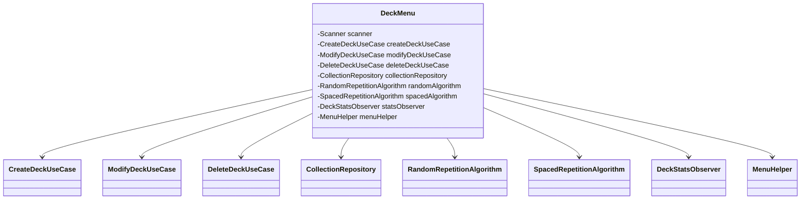
```mermaid
classDiagram
    class DeckMenu {
        -Scanner scanner
        -CreateDeckUseCase createDeckUseCase
        -ModifyDeckUseCase modifyDeckUseCase
        -DeleteDeckUseCase deleteDeckUseCase
        -CollectionRepository collectionRepository
        -RandomRepetitionAlgorithm randomAlgorithm
        -SpacedRepetitionAlgorithm spacedAlgorithm
        -DeckStatsObserver statsObserver
        -MenuHelper menuHelper
    }
    DeckMenu --> CreateDeckUseCase
    DeckMenu --> ModifyDeckUseCase
    DeckMenu --> DeleteDeckUseCase
    DeckMenu --> CollectionRepository
    DeckMenu --> RandomRepetitionAlgorithm
    DeckMenu --> SpacedRepetitionAlgorithm
    DeckMenu --> DeckStatsObserver
    DeckMenu --> MenuHelper
```

**Aufgabe:** `DeckMenu` verwaltet das CLI-Menü für Deck-Operationen.

**Begründung hohe Kopplung:** `DeckMenu` hat 9 Abhängigkeiten (8 injizierte + Scanner). Es ist an 3 Use Cases, 2 konkrete Algorithmen, 1 Repository, 1 Observer und 1 Helper gekoppelt. Das Hinzufügen oder Ändern eines Algorithmus erfordert Änderungen in `DeckMenu`. **Auflösung:** Die Algorithmus-Auswahl in eine eigene `AlgorithmSelector`-Klasse extrahieren und die konkreten Typen durch eine `List<RepetitionAlgorithm>` ersetzen würde die Kopplung von 9 auf 7 Abhängigkeiten reduzieren und die konkrete Plugin-Abhängigkeit entfernen.

### Analyse GRASP: Hohe Kohäsion

#### Positiv-Beispiel: CardContent

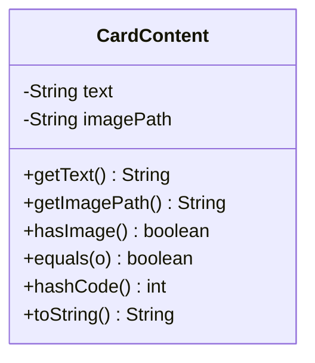
```mermaid
classDiagram
    class CardContent {
        -String text
        -String imagePath
        +getText() String
        +getImagePath() String
        +hasImage() boolean
        +equals(o) boolean
        +hashCode() int
        +toString() String
    }
```

**Begründung:** `CardContent` (`src/main/java/com/cardrep/domain/model/CardContent.java`) ist maximal kohäsiv: alle Felder (`text`, `imagePath`) und alle Methoden (`getText()`, `getImagePath()`, `hasImage()`) dienen ausschließlich dem Konzept "Karteninhalt". Es gibt keine Methode, die nichts mit dem Textinhalt zu tun hat. Die Klasse ist immutable (alle Felder `final`), was die Kohäsion weiter stärkt: jede Instanz repräsentiert genau einen konsistenten Zustand.

#### Negativ-Beispiel: DeckMenu


```mermaid
classDiagram
    class DeckMenu {
        -Scanner scanner
        -CreateDeckUseCase createDeckUseCase
        -ModifyDeckUseCase modifyDeckUseCase
        -DeleteDeckUseCase deleteDeckUseCase
        -CollectionRepository collectionRepository
        -RandomRepetitionAlgorithm randomAlgorithm
        -SpacedRepetitionAlgorithm spacedAlgorithm
        -DeckStatsObserver statsObserver
        -MenuHelper menuHelper
        +run() void
        -createDeck() void
        -modifyDeck() void
        -deleteDeck() void
        -viewDeckStats() void
        -selectAlgorithm() RepetitionAlgorithm
    }
```

**Begründung:** `DeckMenu` (`src/main/java/com/cardrep/adapter/cli/DeckMenu.java`) hat niedrige Kohäsion: seine Methoden bedienen vier verschiedene funktionale Bereiche: (1) Deck-CRUD (`createDeck`, `modifyDeck`, `deleteDeck`), (2) Algorithmus-Auswahl (`selectAlgorithm`), (3) Statistik-Anzeige (`viewDeckStats`), (4) User-Input-Parsing. Nicht alle Felder werden von allen Methoden genutzt: z.B. `randomAlgorithm` und `spacedAlgorithm` werden nur von `selectAlgorithm()` verwendet, `statsObserver` nur von `createDeck()`. Die geringe Überlappung der Feld-Nutzung zwischen Methoden ist ein Indikator für niedrige Kohäsion. **Auflösung:** `selectAlgorithm()` und die zugehörigen Felder in eine eigene `AlgorithmSelector`-Klasse extrahieren würde die Kohäsion der verbleibenden `DeckMenu`-Klasse erhöhen.

### Don't Repeat Yourself (DRY)

**Commit:** `aafecbc` (Refactoring: Extract MenuHelper to eliminate duplicated selection logic)

**Vorher (CardMenu.java)**: duplizierte `selectDeck()`-Methode:

```java
private String selectDeck() {
    List<Deck> decks = deckRepository.findAll();
    if (decks.isEmpty()) {
        System.out.println("No decks available. Create a deck first.");
        return null;
    }
    System.out.println("\nAvailable decks:");
    for (int i = 0; i < decks.size(); i++) {
        System.out.println("  " + (i + 1) + ". " + decks.get(i).getName());
    }
    System.out.print("Select deck (number): ");
    try {
        int index = Integer.parseInt(scanner.nextLine().trim()) - 1;
        if (index < 0 || index >= decks.size()) {
            System.out.println("Invalid selection.");
            return null;
        }
        return decks.get(index).getId();
    } catch (NumberFormatException e) {
        System.out.println("Invalid input.");
        return null;
    }
}
```

Die gleiche Logik war in `CardMenu` und `LearningSession` dupliziert. Ebenso war `selectCollection()` in `DeckMenu` und `CollectionMenu` dupliziert.

**Nachher (MenuHelper.java)**: generische Methode:

```java
public <T> String selectFromList(List<T> items, String header,
                                 Function<T, String> displayFunc,
                                 Function<T, String> idFunc) {
    if (items.isEmpty()) {
        System.out.println("No items available.");
        return null;
    }
    System.out.println("\n" + header + ":");
    for (int i = 0; i < items.size(); i++) {
        System.out.println("  " + (i + 1) + ". " + displayFunc.apply(items.get(i)));
    }
    System.out.print("Select (number): ");
    try {
        int index = Integer.parseInt(scanner.nextLine().trim()) - 1;
        if (index < 0 || index >= items.size()) {
            System.out.println("Invalid selection.");
            return null;
        }
        return idFunc.apply(items.get(index));
    } catch (NumberFormatException e) {
        System.out.println("Invalid input.");
        return null;
    }
}
```

**Auswirkung:** 4 Klassen delegieren jetzt an `MenuHelper`. Die generische `selectFromList()`-Methode kann für jede zukünftige Listen-Auswahl wiederverwendet werden. Netto-Änderung: +190 Zeilen (neue Datei), -208 Zeilen (entfernter Code) = **18 Zeilen weniger** bei besserer Struktur.

---

## Kapitel 5: Unit Tests

### 10 Unit Tests

| # | Unit Test | Beschreibung |
|---|-----------|-------------|
| 1 | `CardTest#createCard_withValidContent_shouldSucceed` | Testet erfolgreiche Karten-Erstellung mit gültigem Front/Back-Content |
| 2 | `CardTest#createCard_withNullFront_shouldThrow` | Testet, dass null-Front eine Exception wirft |
| 3 | `DeckTest#addCard_duplicateId_shouldThrow` | Testet, dass doppeltes Hinzufügen einer Karte (gleiche ID) eine Exception wirft |
| 4 | `DeckTest#computeStats_withReviewedCards_shouldAggregateCorrectly` | Testet korrekte Aggregation von DeckStats nach Reviews |
| 5 | `DeckTest#observer_shouldBeNotifiedOnCardAdd` | Testet, dass Observer bei `addCard()` benachrichtigt werden |
| 6 | `CollectionTest#addChildCollection_withDuplicateName_shouldThrow` | Testet Business-Regel: eindeutige Namen innerhalb einer Collection |
| 7 | `CardUseCaseTest#createCard_shouldSaveCardAndAddToDeck` | Testet Use-Case-Orchestrierung: Karte wird gespeichert UND zum Deck hinzugefügt |
| 8 | `DeckUseCaseTest#deleteDeck_shouldDeleteAllCardsAndDeck` | Testet Cascade-Delete: alle Karten und das Deck werden entfernt |
| 9 | `InMemoryCardRepositoryTest#save_shouldStoreCard` | Testet, dass die Fake-Implementierung korrekt speichert |
| 10 | `RepetitionAlgorithmTest#spacedRepetition_shouldPrioritizeUnreviewedCards` | Testet, dass ungeprüfte Karten bevorzugt werden |

### ATRIP: Automatic

Alle Tests laufen automatisch via `mvn test` ohne manuelle Intervention. JUnit 5 entdeckt und führt alle Tests aus. JaCoCo generiert Coverage-Reports automatisch. Keine manuellen Schritte, keine UI-Interaktion, keine Datenbank-Setup erforderlich: die In-Memory-Repositories starten leer und brauchen keine Konfiguration.

### ATRIP: Thorough

**Positiv-Beispiel:** `DeckTest` (13 Tests)

```java
@Test
void addCard_duplicateId_shouldThrow() {
    deck.addCard(card);
    assertThrows(IllegalArgumentException.class, () -> deck.addCard(card));
}

@Test
void removeCard_nonExistentCard_shouldThrow() {
    assertThrows(IllegalArgumentException.class,
        () -> deck.removeCard("non-existent-id"));
}

@Test
void getNextCard_emptyDeck_shouldReturnNull() {
    assertNull(deck.getNextCard());
}
```

**Analyse:** `DeckTest` testet sowohl Happy Paths (addCard, removeCard, computeStats) als auch Edge Cases (doppelte Karte, nicht existente Karte, leeres Deck, null-Parameter). Alle Grenzfälle der Geschäftslogik sind abgedeckt.

**Negativ-Beispiel:** `InMemoryCardRepositoryTest` (6 Tests)

```java
@Test
void deleteById_shouldRemoveCard() {
    repository.save(card);
    repository.deleteById(card.getId());
    assertFalse(repository.existsById(card.getId()));
}
```

**Analyse:** Es fehlt ein Test für `deleteById()` mit einer nicht existierenden ID: das Verhalten bei ungültiger ID wird nicht getestet. Ebenso fehlt ein Test für `save()` mit einer bereits existierenden Karte (Update-Verhalten). Die Tests decken nur den Standard-Pfad ab.

### ATRIP: Professional

**Positiv-Beispiel:** `CardUseCaseTest`

```java
@Test
void createCard_shouldSaveCardAndAddToDeck() {
    when(deckRepository.findById(deck.getId())).thenReturn(Optional.of(deck));
    when(cardRepository.save(any(Card.class))).thenAnswer(i -> i.getArgument(0));

    Card result = createCardUseCase.execute(deck.getId(), front, back);

    assertNotNull(result);
    assertEquals(front, result.getFront());
    verify(cardRepository).save(any(Card.class));
    verify(deckRepository).save(deck);
}
```

**Analyse:** Professionell: sprechende Methodennamen (`action_expectedBehavior`-Muster), klares Arrange-Act-Assert-Muster, gezielte Verifizierung der Interaktionen, eigene `@BeforeEach`-Setup pro Test.

**Negativ-Beispiel:** `RepetitionAlgorithmTest`

```java
@Test
void randomRepetition_shouldReturnACard() {
    Card result = randomAlgorithm.selectNextCard(cards);
    assertNotNull(result);
    assertTrue(cards.contains(result));
}
```

**Analyse:** Weniger professionell: der Testname `shouldReturnACard` ist vage: er beschreibt nicht die Vorbedingung oder das erwartete Ergebnis präzise genug. Besser wäre: `selectNextCard_withMultipleCards_shouldReturnCardFromList`. Außerdem testet er nur dass *irgendeine* Karte zurückgegeben wird, nicht ob die Verteilung korrekt ist.

### Code Coverage

Coverage wird via **JaCoCo** gemessen (`mvn test jacoco:report`). Die Domain- und Application-Schichten haben die höchste Coverage, da sie die Kerngeschäftslogik enthalten und am gründlichsten getestet sind. Die Adapter-Schicht (CLI) hat niedrigere Coverage, da sie primär User-I/O verarbeitet, was manuell getestet wird. Insgesamt sind **61 Tests** vorhanden, die die wichtigsten Geschäftsregeln und Edge Cases abdecken.

### Fakes und Mocks

#### Mock: CardRepository in CardUseCaseTest

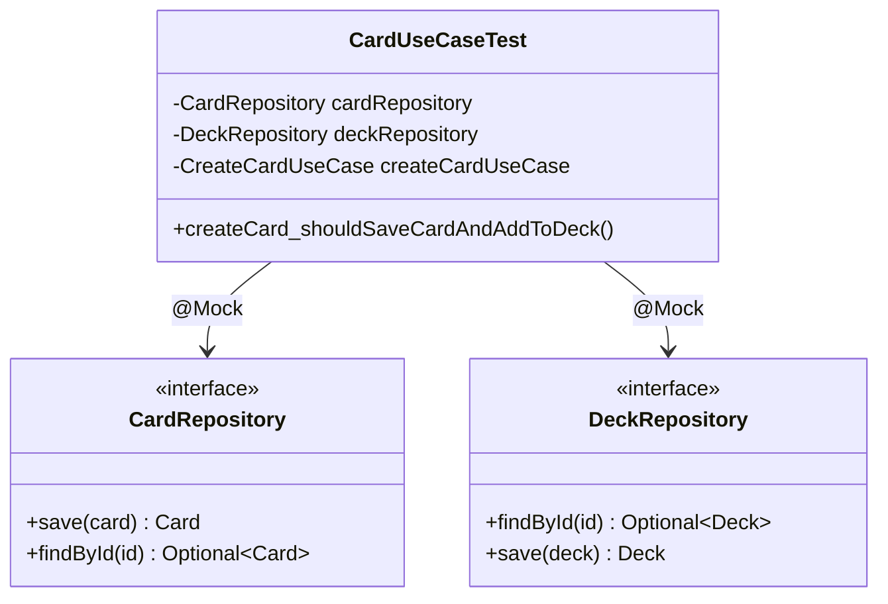
```mermaid
classDiagram
    class CardUseCaseTest {
        -CardRepository cardRepository
        -DeckRepository deckRepository
        -CreateCardUseCase createCardUseCase
        +createCard_shouldSaveCardAndAddToDeck()
    }
    class CardRepository {
        <<interface>>
        <<mock>>
        +save(card) Card
        +findById(id) Optional~Card~
    }
    class DeckRepository {
        <<interface>>
        <<mock>>
        +findById(id) Optional~Deck~
        +save(deck) Deck
    }
    CardUseCaseTest --> CardRepository : @Mock
    CardUseCaseTest --> DeckRepository : @Mock
```

**Analyse:** Mockito-Mocks werden verwendet, um die Use Cases isoliert von der Persistenz zu testen. `when(...).thenReturn(...)` definiert erwartetes Verhalten, `verify(...)` prüft, dass die korrekten Repository-Methoden aufgerufen wurden. Vorteil: Der Test ist schnell, deterministisch, und unabhängig von der Implementierung.

```java
@Mock private CardRepository cardRepository;
@Mock private DeckRepository deckRepository;

@Test
void deleteDeck_shouldDeleteAllCardsAndDeck() {
    when(deckRepository.findById(deck.getId())).thenReturn(Optional.of(deck));
    deleteDeckUseCase.execute(deck.getId(), collectionId);
    verify(cardRepository).deleteById(card1.getId());  // Interaktion verifizieren
}
```

#### Fake: InMemoryCardRepository in InMemoryCardRepositoryTest

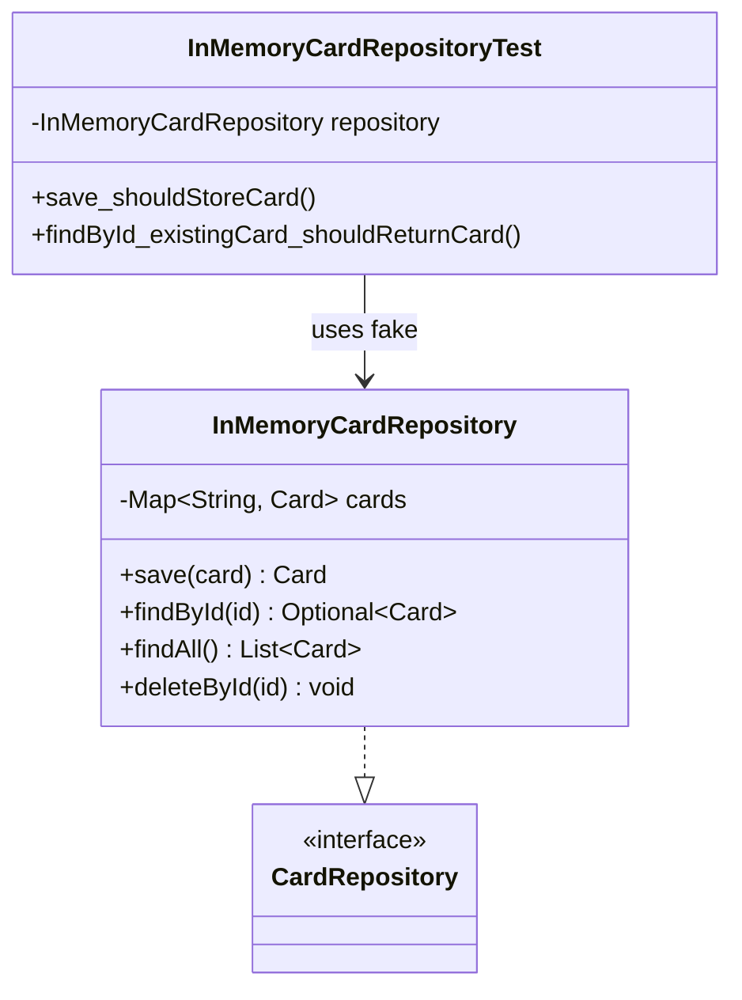
```mermaid
classDiagram
    class InMemoryCardRepositoryTest {
        -InMemoryCardRepository repository
        +save_shouldStoreCard()
        +findById_existingCard_shouldReturnCard()
    }
    class InMemoryCardRepository {
        -Map~String, Card~ cards
        +save(card) Card
        +findById(id) Optional~Card~
        +findAll() List~Card~
        +deleteById(id) void
    }
    class CardRepository {
        <<interface>>
    }
    InMemoryCardRepositoryTest --> InMemoryCardRepository : uses fake
    InMemoryCardRepository ..|> CardRepository
```

**Analyse:** `InMemoryCardRepository` ist ein **Fake**: eine echte, funktionierende Implementierung (HashMap-basiert) des `CardRepository`-Interfaces. Im Gegensatz zu einem Mock hat es echtes Verhalten und echten Zustand. Es wird in Tests verwendet, um die Korrektheit der Implementierung selbst zu verifizieren, und dient im Produktionscode als leichtgewichtige Persistenz.

```java
private InMemoryCardRepository repository;

@BeforeEach
void setUp() {
    repository = new InMemoryCardRepository();  // Echte Implementierung, kein Mock
}

@Test
void save_shouldStoreCard() {
    repository.save(card);
    assertTrue(repository.existsById(card.getId()));
}
```

---

## Kapitel 6: Domain Driven Design

### Ubiquitous Language

| Bezeichnung | Bedeutung | Begründung |
|-------------|-----------|------------|
| **Card** | Eine Lernkarte mit Vorderseite (Frage) und Rückseite (Antwort), die Review-Statistiken trackt | Zentrales Domänenkonzept: jeder Benutzer interagiert mit Karten beim Lernen. Direkt als Java-Klasse `Card` im Code |
| **Deck** | Eine Sammlung von Karten mit einem konfigurierbaren Wiederholungsalgorithmus | Organisationseinheit für Karten: ein Deck wird als Ganzes gelernt. Eigenständiges Aggregate Root im Code |
| **Difficulty** | Die vom Benutzer wahrgenommene Schwierigkeit einer Karte (EASY, MEDIUM, HARD, AGAIN) | Bestimmt die Wiederholungsfrequenz: ist der zentrale Input des Spaced-Repetition-Systems. Als Enum `Difficulty` implementiert |
| **Collection** | Ein hierarchischer Ordner, der Decks und weitere Collections enthält | Ermöglicht beliebig tiefe Organisationsstrukturen (z.B. "Informatik > Algorithmen > Sortierung"). Als Baum-Struktur mit Rekursion implementiert |

### Entities

#### Card

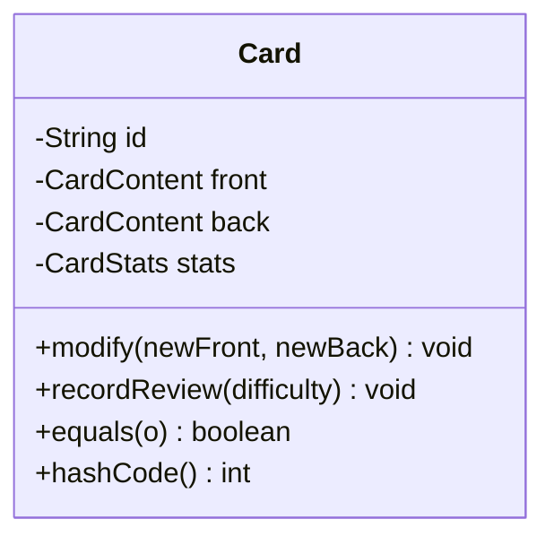
```mermaid
classDiagram
    class Card {
        -String id
        -CardContent front
        -CardContent back
        -CardStats stats
        +modify(newFront, newBack) void
        +recordReview(difficulty) void
        +equals(o) boolean
        +hashCode() int
    }
```

**Beschreibung:** `Card` (`src/main/java/com/cardrep/domain/model/Card.java`) repräsentiert eine Lernkarte mit eindeutiger UUID-Identität. Der Inhalt (front/back) kann sich über `modify()` ändern, Statistiken ändern sich über `recordReview()`, aber die Identität bleibt gleich.

**Begründung:** Card ist eine Entity, weil sie eine **eindeutige Identität** besitzt, die über ihren Lebenszyklus hinweg bestehen bleibt. Zwei Karten mit identischem Text sind trotzdem verschiedene Karten (unterschiedliche IDs, unterschiedliche Statistiken). `equals()` und `hashCode()` basieren ausschließlich auf der ID.

### Value Objects

#### CardContent

```mermaid
classDiagram
    class CardContent {
        -String text
        -String imagePath
        +getText() String
        +getImagePath() String
        +hasImage() boolean
        +equals(o) boolean
        +hashCode() int
    }
    note for CardContent "Immutable: all fields final, no setters. Equality by value (text + imagePath)."
```

**Beschreibung:** `CardContent` (`src/main/java/com/cardrep/domain/model/CardContent.java`) repräsentiert den Textinhalt (plus optionalem Bild) einer Kartenseite.

**Begründung:** CardContent ist ein Value Object, weil es **keine eigene Identität** besitzt: zwei `CardContent`-Instanzen mit gleichem Text und gleichem Bildpfad sind vollständig austauschbar (gleich im Sinne von `equals()`). Es ist immutable (alle Felder `final`, keine Setter), und wird über seine Attribute definiert, nicht über eine ID.

### Repositories

#### CardRepository

```mermaid
classDiagram
    class CardRepository {
        <<interface>>
        +save(card) Card
        +findById(id) Optional~Card~
        +findAll() List~Card~
        +deleteById(id) void
        +existsById(id) boolean
    }
    class InMemoryCardRepository {
        -Map~String, Card~ cards
        +save(card) Card
        +findById(id) Optional~Card~
        +findAll() List~Card~
        +deleteById(id) void
        +existsById(id) boolean
    }
    CardRepository <|.. InMemoryCardRepository
```

**Beschreibung:** `CardRepository` (`src/main/java/com/cardrep/domain/repository/CardRepository.java`) definiert den Vertrag für die Persistenz von Cards. Die Implementierung `InMemoryCardRepository` nutzt eine HashMap.

**Begründung:** Repositories sind der DDD-Mechanismus, um die Domain von Persistenzdetails zu entkoppeln. Das Interface ist in der Domain-Schicht definiert (Dependency Inversion), die Implementierung in der Plugin-Schicht. So kann die Speichertechnologie gewechselt werden (z.B. zu einer Datenbank), ohne die Domain oder Application-Schicht zu ändern.

### Aggregates

#### Deck (Aggregate Root)

```mermaid
classDiagram
    class Deck {
        -String id
        -String name
        -List~Card~ cards
        +addCard(card) void
        +removeCard(cardId) void
        +getNextCard() Card
        +computeStats() DeckStats
    }
    class Card {
        -String id
        -CardContent front
        -CardContent back
        -CardStats stats
    }
    Deck *-- Card : owns (cascade delete)
    note for Deck "Aggregate Root: controls access to Cards. Invariant: no duplicate card IDs."
```

**Beschreibung:** `Deck` ist Aggregate Root und kontrolliert den Zugriff auf seine `Card`-Objekte. Definiert in der Ubiquitous Language: *"Eine Karte muss zu genau einem Deck gehören"* und *"Wenn ein Deck gelöscht wird, werden alle zugehörigen Karten ebenfalls gelöscht."*

**Begründung:** Deck ist ein Aggregate, weil es eine **Konsistenzgrenze** definiert: Karten können nur über das Deck hinzugefügt/entfernt werden, nicht direkt. Das Deck erzwingt Invarianten (keine doppelten Card-IDs) und garantiert kaskadierendes Löschen. External Entities referenzieren Cards nur über das Deck, was transaktionale Konsistenz sichert.

---

## Kapitel 7: Refactoring

### Code Smells

#### Code Smell 1: Duplicated Code (selectDeck in CardMenu und LearningSession)

**Code-Beispiel (CardMenu.java, vor Refactoring):**

```java
private String selectDeck() {
    List<Deck> decks = deckRepository.findAll();
    if (decks.isEmpty()) {
        System.out.println("No decks available. Create a deck first.");
        return null;
    }
    System.out.println("\nAvailable decks:");
    for (int i = 0; i < decks.size(); i++) {
        System.out.println("  " + (i + 1) + ". " + decks.get(i).getName());
    }
    System.out.print("Select deck (number): ");
    // ... parsing logic
}
```

Nahezu identischer Code existierte in `LearningSession.java`. Ebenso war `selectCollection()` in `DeckMenu` und `CollectionMenu` dupliziert.

**Lösungsweg:** Extract Class: alle Selektions-Methoden wurden in eine neue Klasse `MenuHelper` zentralisiert. Eine generische `selectFromList()`-Methode nutzt Java Generics und `Function`-Parameter, um für jede Entity-Auswahl wiederverwendbar zu sein.

#### Code Smell 2: Long Method (Deck.computeStats)

**Code-Beispiel (Deck.java, vor Refactoring):**

```java
public DeckStats computeStats() {
    int total = cards.size();
    int reviewed = 0;
    int easy = 0, medium = 0, hard = 0, failed = 0;
    for (Card card : cards) {
        if (card.getStats().hasBeenReviewed()) {
            reviewed++;
            Difficulty lastDifficulty = card.getStats().getLastDifficulty();
            if (lastDifficulty == Difficulty.EASY) easy++;
            else if (lastDifficulty == Difficulty.MEDIUM) medium++;
            else if (lastDifficulty == Difficulty.HARD) hard++;
            else if (lastDifficulty == Difficulty.AGAIN) failed++;
        }
    }
    return new DeckStats(total, reviewed, easy, medium, hard, failed);
}
```

Die Methode mischt Filterlogik (welche Karten wurden reviewed?) mit Zähllogik (Kategorisierung nach Difficulty) in einer einzigen Schleife mit verschachtelten if-else-Ketten.

**Lösungsweg:** Extract Method: Aufteilen in `getReviewedCards()` (filtert reviewed Karten) und `countByLastDifficulty(cards, difficulty)` (zählt Karten nach Schwierigkeit). Jede Methode hat eine einzige Verantwortlichkeit, die deklarative Stream-basierte Lösung ersetzt die imperative Schleife.

### 2 Refactorings

#### Refactoring 1: Extract Class: MenuHelper (DRY)

**Commit:** `aafecbc`

**Problem:** `selectDeck()` war in `CardMenu` und `LearningSession` dupliziert. `selectCollection()` war in `DeckMenu` und `CollectionMenu` dupliziert. Ca. 120 Zeilen duplizierter Code über 4 Klassen.

**UML Class Diagram (Vorher: duplizierte Methoden):**

```mermaid
classDiagram
    class CardMenu {
        -DeckRepository deckRepository
        -Scanner scanner
        +selectDeck() String
    }
    class LearningSession {
        -DeckRepository deckRepository
        -Scanner scanner
        +selectDeck() String
    }
    class DeckMenu {
        -CollectionRepository collectionRepository
        -Scanner scanner
        +selectCollection() String
    }
    class CollectionMenu {
        -CollectionRepository collectionRepository
        -Scanner scanner
        +selectCollection() String
    }
    note for CardMenu "Duplicated selectDeck()"
    note for LearningSession "Duplicated selectDeck()"
    note for DeckMenu "Duplicated selectCollection()"
    note for CollectionMenu "Duplicated selectCollection()"
```

**UML Class Diagram (Nachher: extrahierte MenuHelper):**

```mermaid
classDiagram
    class MenuHelper {
        -DeckRepository deckRepository
        -CollectionRepository collectionRepository
        -Scanner scanner
        +selectFromList(items, header, displayFunc, idFunc) String
        +selectDeck() String
        +selectCollection() String
    }
    class CardMenu {
        -MenuHelper menuHelper
    }
    class LearningSession {
        -MenuHelper menuHelper
    }
    class DeckMenu {
        -MenuHelper menuHelper
    }
    class CollectionMenu {
        -MenuHelper menuHelper
    }
    CardMenu --> MenuHelper : delegates
    LearningSession --> MenuHelper : delegates
    DeckMenu --> MenuHelper : delegates
    CollectionMenu --> MenuHelper : delegates
```

**Begründung:** DRY-Prinzip verletzt. Die generische `selectFromList()`-Methode nutzt Java Generics und `Function`-Parameter, um für jede Entity-Auswahl wiederverwendbar zu sein.

#### Refactoring 2: Extract Method: Deck.computeStats()

**Commit:** `aafecbc`

**Problem:** `computeStats()` war eine monolithische Methode mit Schleife und verschachtelten if-else-Ketten. Sie mischte Filterlogik mit Zähllogik.

**UML Class Diagram (Vorher: monolithische Methode):**

```mermaid
classDiagram
    class Deck {
        -List~Card~ cards
        +computeStats() DeckStats
    }
    note for Deck "computeStats() contains all logic: filtering, counting by difficulty, building DeckStats"
```

**Vorher (Deck.java):**

```java
public DeckStats computeStats() {
    int total = cards.size();
    int reviewed = 0;
    int easy = 0, medium = 0, hard = 0, failed = 0;

    for (Card card : cards) {
        if (card.getStats().hasBeenReviewed()) {
            reviewed++;
            Difficulty lastDifficulty = card.getStats().getLastDifficulty();
            if (lastDifficulty == Difficulty.EASY) easy++;
            else if (lastDifficulty == Difficulty.MEDIUM) medium++;
            else if (lastDifficulty == Difficulty.HARD) hard++;
            else if (lastDifficulty == Difficulty.AGAIN) failed++;
        }
    }
    return new DeckStats(total, reviewed, easy, medium, hard, failed);
}
```

**UML Class Diagram (Nachher: extrahierte Methoden):**

```mermaid
classDiagram
    class Deck {
        -List~Card~ cards
        +computeStats() DeckStats
        -getReviewedCards() List~Card~
        -countByLastDifficulty(cards, difficulty) int
    }
    note for Deck "computeStats() delegates to focused helper methods"
```

**Nachher (Deck.java):**

```java
public DeckStats computeStats() {
    int total = cards.size();
    List<Card> reviewedCards = getReviewedCards();
    int reviewed = reviewedCards.size();
    return new DeckStats(total, reviewed,
            countByLastDifficulty(reviewedCards, Difficulty.EASY),
            countByLastDifficulty(reviewedCards, Difficulty.MEDIUM),
            countByLastDifficulty(reviewedCards, Difficulty.HARD),
            countByLastDifficulty(reviewedCards, Difficulty.AGAIN));
}

private List<Card> getReviewedCards() {
    return cards.stream()
            .filter(card -> card.getStats().hasBeenReviewed())
            .toList();
}

private int countByLastDifficulty(List<Card> reviewedCards, Difficulty difficulty) {
    return (int) reviewedCards.stream()
            .filter(card -> card.getStats().getLastDifficulty() == difficulty)
            .count();
}
```

**Begründung:** Jede Methode hat jetzt eine einzige Verantwortlichkeit: `getReviewedCards()` filtert, `countByLastDifficulty()` zählt. Die deklarative Stream-basierte Lösung ersetzt die imperative Schleife mit mutablen Zählern.

---

## Kapitel 8: Entwurfsmuster

### Entwurfsmuster: Strategy Pattern: RepetitionAlgorithm

Das **Strategy Pattern** erlaubt es, den Scheduling-Algorithmus zur Laufzeit auszuwählen und zu wechseln. Jedes Deck kann einen anderen Algorithmus verwenden, ohne dass die `Deck`-Klasse selbst geändert werden muss.

**Sinnvoller Einsatz:** Verschiedene Benutzer bevorzugen verschiedene Lernstrategien. Manche wollen zufällige Karten (zum Aufwärmen), andere wollen priorisierte Wiederholung (zum gezielten Lernen). Das Strategy Pattern ermöglicht diesen Wechsel ohne Code-Änderung.

**Participants:**
- **Strategy (Interface):** `RepetitionAlgorithm` (`src/main/java/com/cardrep/domain/service/RepetitionAlgorithm.java`)
- **Concrete Strategy A:** `RandomRepetitionAlgorithm` (`src/main/java/com/cardrep/plugin/algorithm/RandomRepetitionAlgorithm.java`)
- **Concrete Strategy B:** `SpacedRepetitionAlgorithm` (`src/main/java/com/cardrep/plugin/algorithm/SpacedRepetitionAlgorithm.java`)
- **Context:** `Deck` (`src/main/java/com/cardrep/domain/model/Deck.java`)

**UML Class Diagram (Vorher: ohne Strategy Pattern):**

```mermaid
classDiagram
    class Deck {
        -List~Card~ cards
        +getNextCard() Card
    }
    note for Deck "getNextCard() contains hardcoded if/else logic. Adding a new algorithm requires modifying this method."
```

**UML Class Diagram (Nachher: mit Strategy Pattern):**

```mermaid
classDiagram
    class Deck {
        -RepetitionAlgorithm repetitionAlgorithm
        +getNextCard() Card
        +setRepetitionAlgorithm(algo)
    }
    class RepetitionAlgorithm {
        <<interface>>
        +selectNextCard(cards) Card
        +getName() String
    }
    class RandomRepetitionAlgorithm {
        -Random random
        +selectNextCard(cards) Card
        +getName() String
    }
    class SpacedRepetitionAlgorithm {
        +selectNextCard(cards) Card
        -calculatePriority(card) int
        +getName() String
    }
    Deck --> RepetitionAlgorithm : uses
    RepetitionAlgorithm <|.. RandomRepetitionAlgorithm
    RepetitionAlgorithm <|.. SpacedRepetitionAlgorithm
```

**Funktionsweise:**

1. Bei der Deck-Erstellung wird ein `RepetitionAlgorithm` übergeben
2. `Deck.getNextCard()` delegiert an `repetitionAlgorithm.selectNextCard(cards)`
3. Der Algorithmus kann zur Laufzeit über `Deck.setRepetitionAlgorithm()` gewechselt werden
4. `RandomRepetitionAlgorithm` wählt eine zufällige Karte
5. `SpacedRepetitionAlgorithm` wählt die Karte mit der niedrigsten Priorität (ungeprüfte Karten zuerst, dann AGAIN > HARD > MEDIUM > EASY)

### Entwurfsmuster: Observer Pattern: DeckStatsObserver

Das **Observer Pattern** benachrichtigt interessierte Parteien, wenn sich Deck-Statistiken ändern (z.B. wenn eine Karte hinzugefügt, entfernt oder reviewed wird). Dies entkoppelt die Benachrichtigungslogik vom Domänenmodell.

**Sinnvoller Einsatz:** Das System muss bei Statistik-Änderungen reagieren (z.B. Logging, UI-Update, Persistenz), ohne dass das Deck alle Empfänger kennen muss. Neue Observer können hinzugefügt werden, ohne die Deck-Klasse zu ändern (OCP).

**Participants:**
- **Subject:** `Deck` (`src/main/java/com/cardrep/domain/model/Deck.java`)
- **Observer (Interface):** `DeckStatsObserver` (`src/main/java/com/cardrep/domain/model/DeckStatsObserver.java`)
- **Concrete Observer:** `DeckStatsLogger` (`src/main/java/com/cardrep/plugin/observer/DeckStatsLogger.java`)

**UML Class Diagram (Vorher: ohne Observer Pattern):**

```mermaid
classDiagram
    class Deck {
        -List~Card~ cards
        -DeckStatsLogger logger
        +addCard(card)
        +removeCard(id)
    }
    class DeckStatsLogger {
        +logStats(deck, stats)
    }
    Deck --> DeckStatsLogger : directly calls
    note for Deck "Deck is tightly coupled to DeckStatsLogger. Adding new notification targets requires modifying Deck."
```

**UML Class Diagram (Nachher: mit Observer Pattern):**

```mermaid
classDiagram
    class Deck {
        -List~DeckStatsObserver~ observers
        +addObserver(observer)
        +removeObserver(observer)
        +notifyObservers()
        +addCard(card)
        +removeCard(id)
    }
    class DeckStatsObserver {
        <<interface>>
        +onDeckStatsChanged(deck, stats)
    }
    class DeckStatsLogger {
        +onDeckStatsChanged(deck, stats)
    }
    Deck --> DeckStatsObserver : notifies
    DeckStatsObserver <|.. DeckStatsLogger
```

**Funktionsweise:**

1. `DeckStatsLogger` wird als Observer registriert via `deck.addObserver(statsLogger)`
2. Bei `Deck.addCard()` oder `Deck.removeCard()` wird `notifyObservers()` ausgelöst
3. `notifyObservers()` berechnet aktuelle `DeckStats` und ruft `onDeckStatsChanged(this, stats)` auf jedem registrierten Observer auf
4. `LearnCardUseCase` ruft ebenfalls `deck.notifyObservers()` nach einem Review auf
5. `DeckStatsLogger` loggt die aktualisierten Statistiken auf der Konsole
6. Weitere Observer (z.B. Persistenz-Observer, UI-Updater) können ohne Änderung der Deck-Klasse hinzugefügt werden
